# Comparing Web Performance

**Final performance test with the fully optimized code**

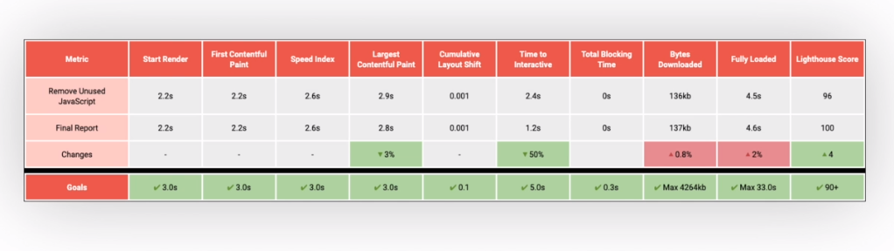

---

**Waterfall**

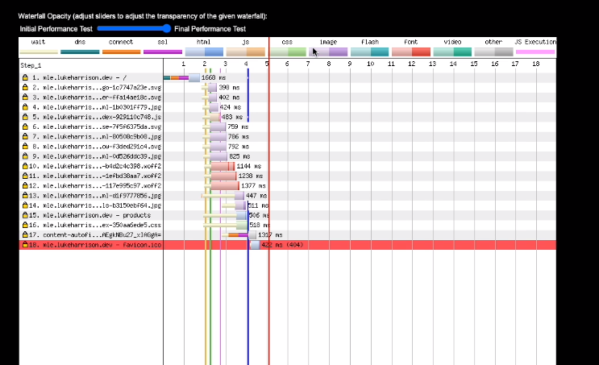

By

- reducing the size of our critical assets
- removing assets we don't need
- lazy loading the rest

this has reduce the size considerably

---

**Visual progress is much faster now**

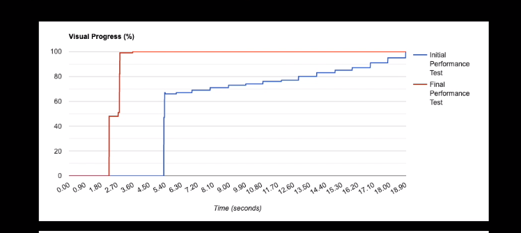

---

**Metrics have seen considerably improvements**

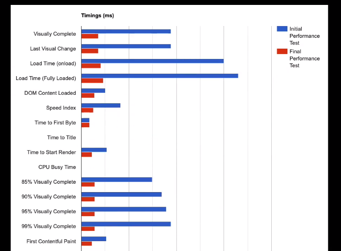

---

**Also making far fewer requests and bytes**

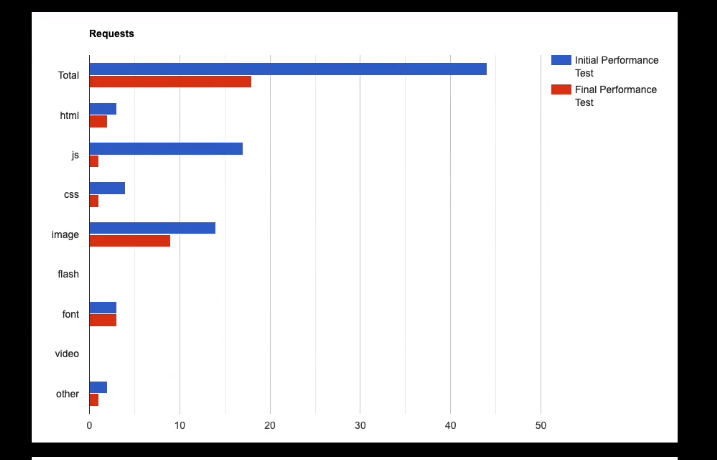

---

**Comparing Initial and Final Report**

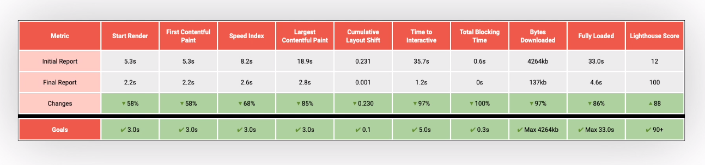

---

**Rendering Metrics**

The biggest changes came either as a result of inline in critical CSS, or for LCP reducing the size of our images which where big bottleneck for other processes at the time.

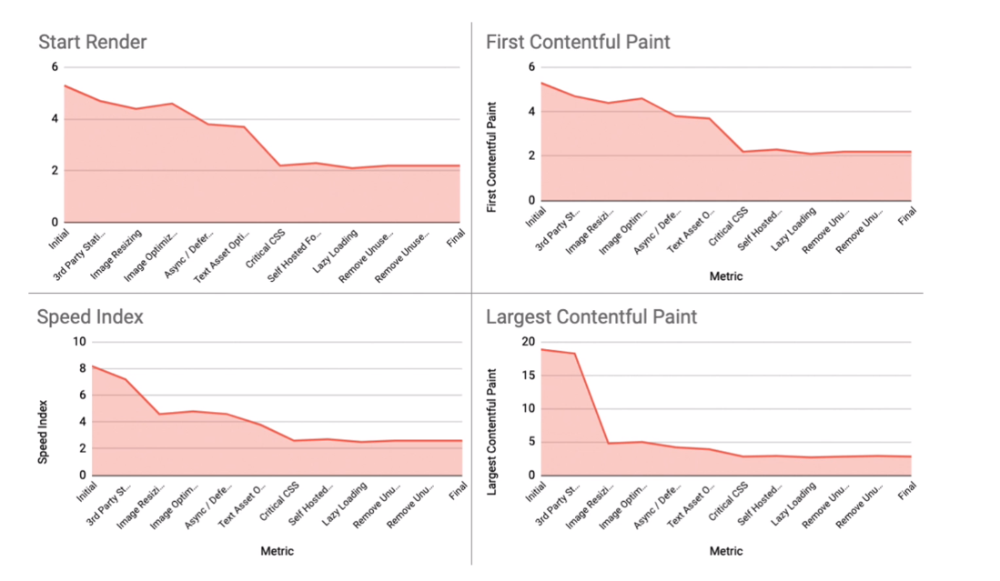

---

**Time To Interactive**

Also drops considerably around the same point

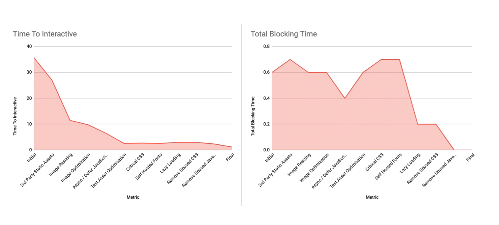

---

**Cumulative Layout Shift**

Odd one, doesn't seem to follow any pattern

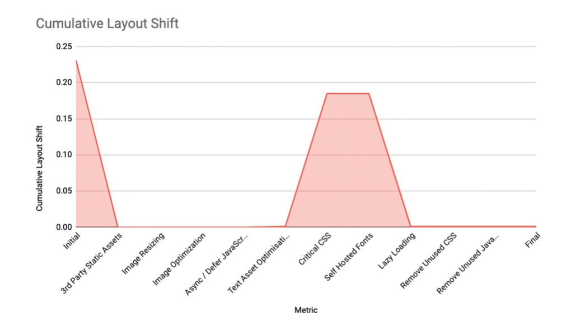

---

**Bytes downloaded**

Bytes downloaded and fully loaded behave more predictably. Dropping significantly when images are optimized and to a smaller degree when lazy loading non-critical assets and removing unused code.

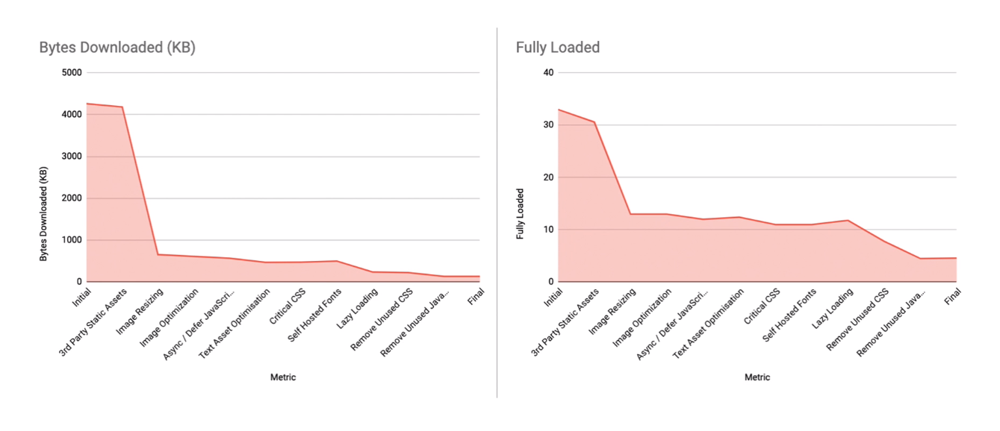

**Lighthouse Score**

It's more of a gradual incline on the road to 100, with no one code change resulting in a stand out boost. This probably is by design on Google's part, as it means the website can't achieve a high performance score without touching all the areas we 've covered.

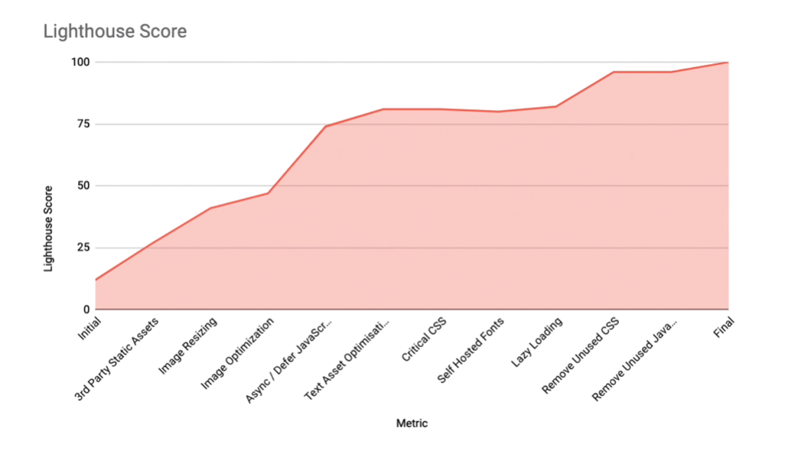

---
